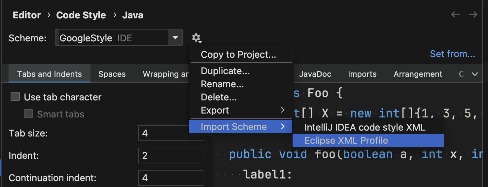

# Conduite_de_projet_2O25_Dev

This repository contains the source code for the Conduite de Projet 2025 development project. It includes both the backend and frontend components of the application.

## Project Structure

- `backend/`: Contains the Spring Boot backend application.
- `frontend/`: Contains the Vue.js frontend application.

## Prerequisites

- Java 21 or higher
- Maven
- Node.js and npm

## Configuration

- Backend configuration is located in `backend/src/main/resources/application.properties`.
- Frontend configuration is managed via environment variables in the `.env` file located in the `frontend/` directory.

In frontend you need to create a .env file based on the .env.example file. - Copy the `.env.example` file to `.env`. - Update the `VITE_BACKEND_URL` and `VITE_PORT` variables as needed.

### IDE Setup

#### VSCode

1. Download [Red Hat Java Language Support](https://marketplace.visualstudio.com/items?itemName=redhat.java).
2. Set the following URL `https://raw.githubusercontent.com/google/styleguide/gh-pages/eclipse-java-google-style.xml` in [settings](vscode://settings/java.format.settings.url).
3. Enter `GoogleStyle` as the profile in [settings](vscode://settings/java.format.settings.profile).

#### IntelliJ IDEA

1. Download the following [XML formatting file](https://raw.githubusercontent.com/google/styleguide/gh-pages/eclipse-java-google-style.xml).
2. In Settings, go to `Editor > Code Style > Java`. Click on `Import Scheme` and then `Eclipse XML Profile`. Select downloaded XML code style file.



3. Set `Tab Size` to 2

### Commit Hooks

Execute `git config core.hooksPath hooks` in this repository to adjust the path of the git hooks directory.

Make hooks in the [hooks](./hooks/) folder executable by running `chmod +x <path to hook>` on all hooks.

### Linting

For the backend install SonarQube in your IDE/Editor to give you linting suggestions.

## Running the Application

### Backend

1. Navigate to the `backend/` directory.
2. Launch the Spring Boot application using Maven:
   ```bash
   mvn spring-boot:run
   ```

The backend will start on the port specified in `application.properties` (default is 8080).

### Frontend

1. Navigate to the `frontend/` directory.
2. Install the dependencies:
   ```bash
   npm install
   ```
3. Start the development server:
   ```bash
   npm run dev
   ```
   The frontend will start on the port specified in the `.env` file (default is 5173).

## Testing

### Frontend Tests

The frontend uses Vitest with Vue Test Utils for unit testing.

### Running Tests

```bash

# Mode watch (recommended during development)
npm test

# Run all tests once
npm run test:run

# UI interface for tests
npm run test:ui

# Generate coverage report
npm run test:coverage
```

The frontend will start on the port specified in the `.env` file (default is 5173).

### Database

To start the database run the following command.

```
docker compose up --build database
```

### Running using Docker

Execute `docker compose up --build` in the root directory of the project. This will start the docker containers for the frontend and backend. These containers use the same default ports as described above.

To stop the docker containers execute `docker compose down -v`.
