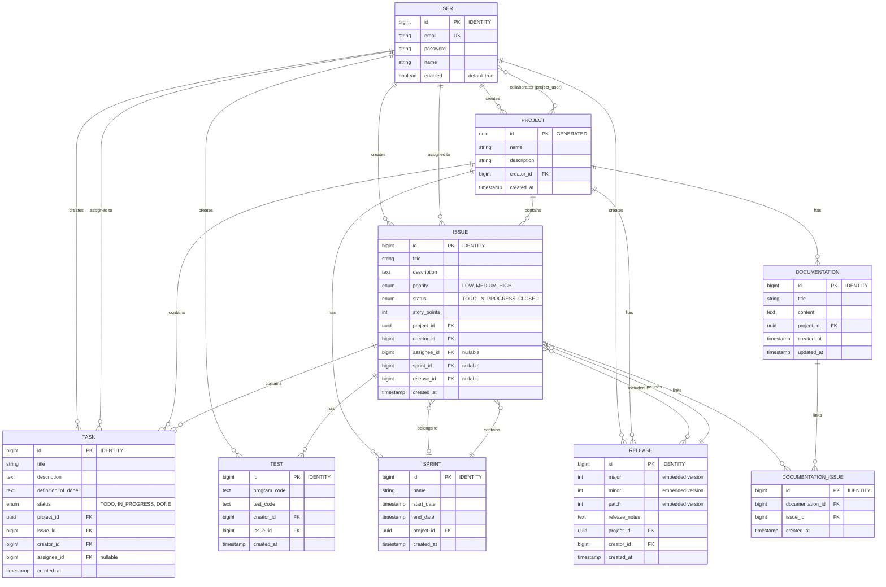

# Database Schema

This document describes the database schema for our project. The schema is represented using an Entity-Relationship Diagram (ERD) to illustrate the relationships between different entities in the system.

## Relationship Legend

- `||--o{` : **One-to-Many** - One entity A can have multiple entities B
- `}o--o{` : **Many-to-Many** - Multiple entities A can have multiple entities B
- `}o--o|` : **Many-to-One** - Multiple entities A can belong to one entity B

### Cardinalities
- `||` : Exactly one (mandatory)
- `}o` : Zero or more (optional)
- `o|` : Zero or one (optional)

### Examples in the schema
- `USER ||--o{ PROJECT : creates` → One USER creates zero or more PROJECTs
- `USER }o--o{ PROJECT : collaborates` → Many-to-many relationship via `project_user` join table
- `ISSUE }o--o| SPRINT : belongs to` → One ISSUE can belong to zero or one SPRINT

