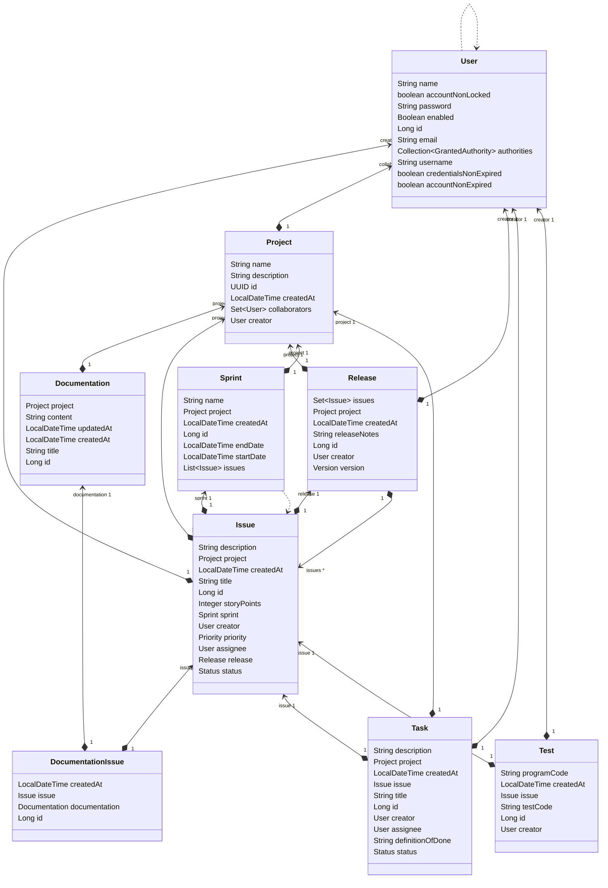

# Class Diagram

```mermaid
classDiagram
direction BT
class Documentation {
   Project project
   String content
   LocalDateTime updatedAt
   LocalDateTime createdAt
   String title
   Long id
}
class DocumentationIssue {
   LocalDateTime createdAt
   Issue issue
   Documentation documentation
   Long id
}
class Issue {
   String description
   Project project
   LocalDateTime createdAt
   String title
   Long id
   Integer storyPoints
   Sprint sprint
   User creator
   Priority priority
   User assignee
   Release release
   Status status
}
class Project {
   String name
   String description
   UUID id
   LocalDateTime createdAt
   Set~User~ collaborators
   User creator
}
class Release {
   Set~Issue~ issues
   Project project
   LocalDateTime createdAt
   String releaseNotes
   Long id
   User creator
   Version version
}
class Sprint {
   String name
   Project project
   LocalDateTime createdAt
   Long id
   LocalDateTime endDate
   LocalDateTime startDate
   List~Issue~ issues
}
class Task {
   String description
   Project project
   LocalDateTime createdAt
   Issue issue
   String title
   Long id
   User creator
   User assignee
   String definitionOfDone
   Status status
}
class Test {
   String programCode
   LocalDateTime createdAt
   Issue issue
   String testCode
   Long id
   User creator
}
class User {
   String name
   boolean accountNonLocked
   String password
   Boolean enabled
   Long id
   String email
   Collection~GrantedAuthority~ authorities
   String username
   boolean credentialsNonExpired
   boolean accountNonExpired
}

Documentation "1" *--> "project 1" Project 
DocumentationIssue "1" *--> "documentation 1" Documentation 
DocumentationIssue "1" *--> "issue 1" Issue 
Issue "1" *--> "project 1" Project 
Issue "1" *--> "release 1" Release 
Issue "1" *--> "sprint 1" Sprint 
Issue "1" *--> "creator 1" User 
Project "1" *--> "collaborators *" User 
Release "1" *--> "issues *" Issue 
Release "1" *--> "project 1" Project 
Release "1" *--> "creator 1" User 
Sprint  ..>  Issue 
Sprint "1" *--> "project 1" Project 
Task "1" *--> "issue 1" Issue 
Task "1" *--> "project 1" Project 
Task "1" *--> "creator 1" User 
Test "1" *--> "issue 1" Issue 
Test "1" *--> "creator 1" User 
User  ..>  User 
```