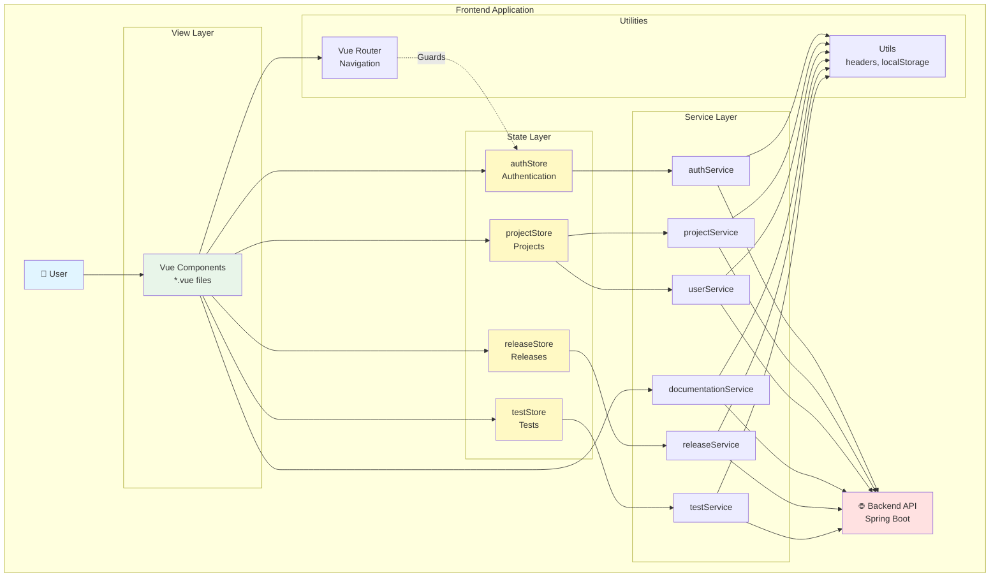
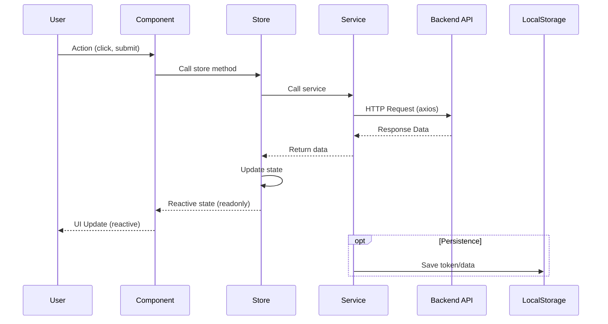
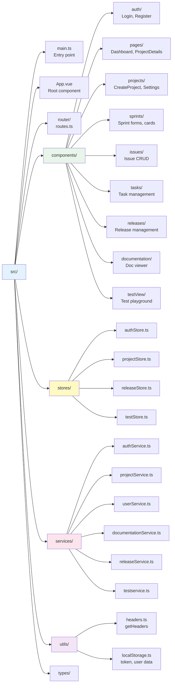
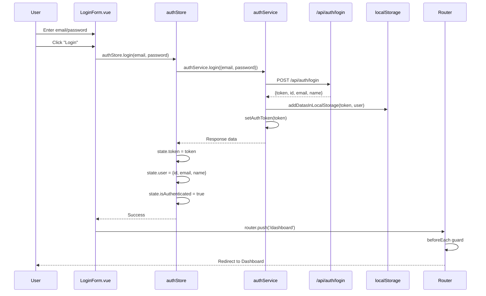
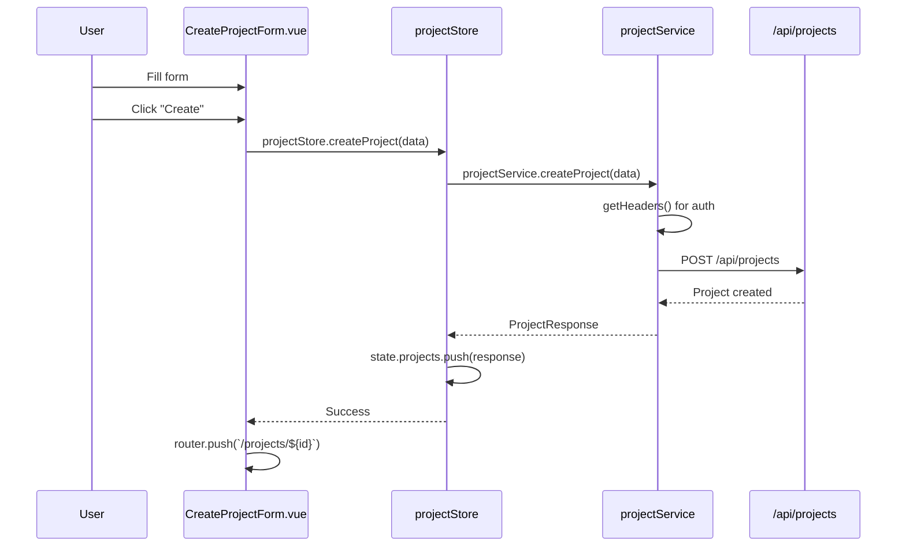
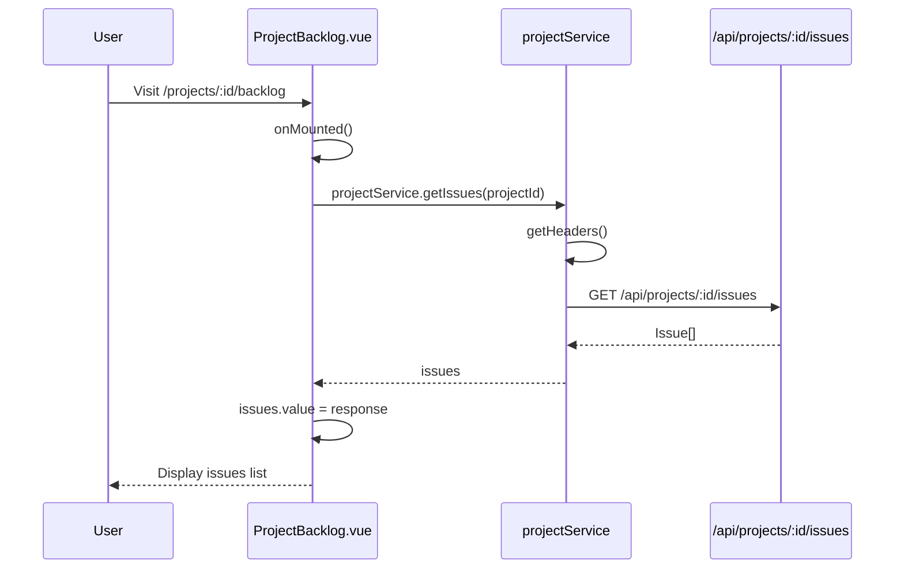
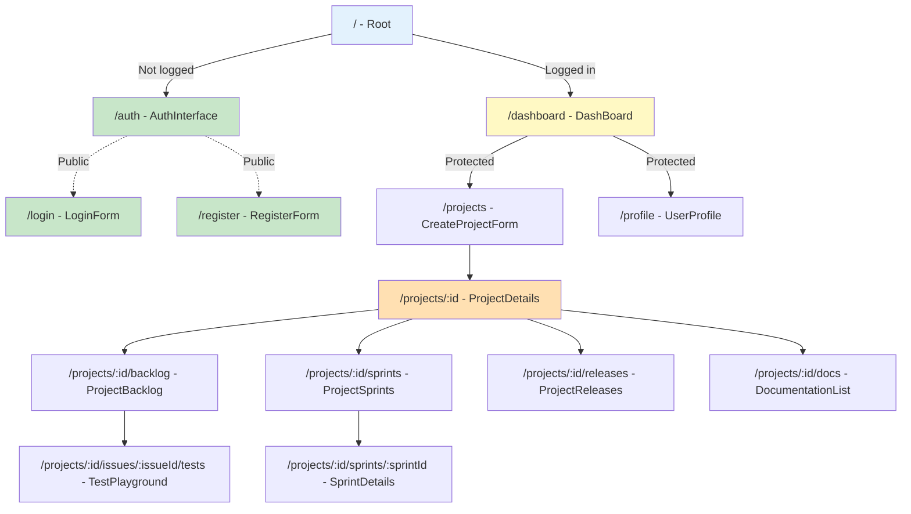
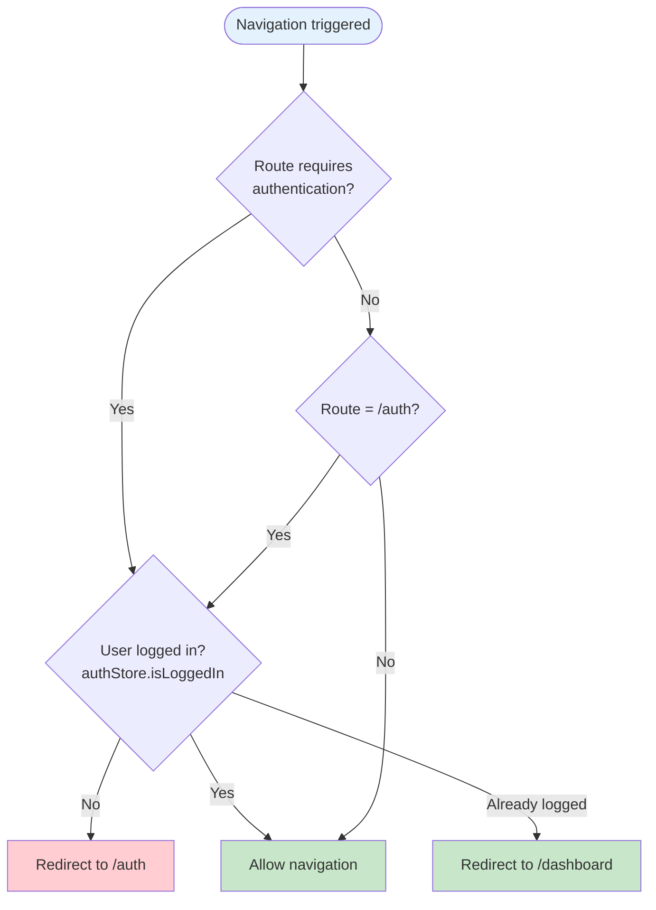
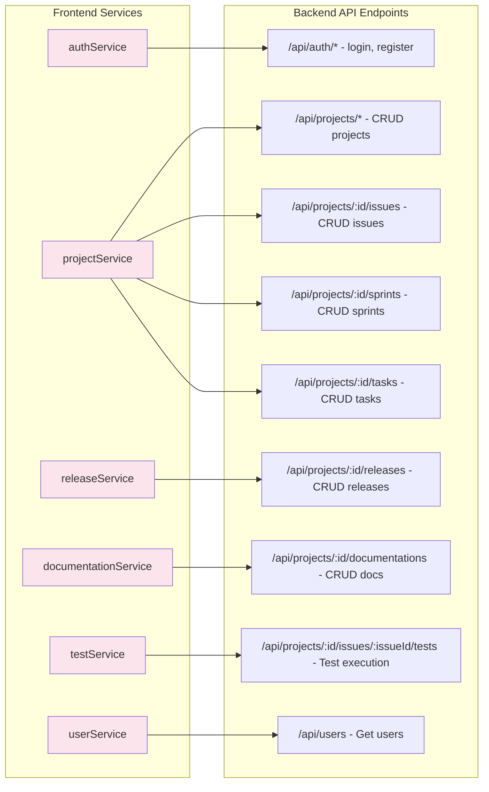

# Frontend Architecture - Vue.js 3

This document describes the architecture of the frontend application built with Vue.js 3 and TypeScript.

## Table of Contents

1. [Overview](#overview)
2. [Layered Architecture](#layered-architecture)
3. [Folder Structure](#folder-structure)
4. [Data Flow](#data-flow)
5. [Routing](#routing)
6. [Main Components](#main-components)

---

## Overview

The application uses a layered architecture with clear separation of concerns:
- **View (Components)**: User interface and presentation logic
- **Store (Global State)**: Reactive shared state management
- **Services**: Communication with the backend API
- **Router**: Navigation and authentication guards
- **Utils**: Utility functions (headers, localStorage)



---

## Layered Architecture

### Standard Data Flow



### Store Pattern (Reactive Store Pattern)

The stores use a custom reactive pattern:

```typescript
// Private state (reactive)
const state = reactive<State>({ ... })

// Export store with readonly state
export const myStore = {
  state: readonly(state),  // ✅ Read-only for components
  
  async myAction() {
    state.data = newValue  // ✅ Modification only through methods
  }
}
```

---

## Folder Structure



---

## Data Flow

### Authentication (Login)



### Project Management



### Loading Project Issues



---

## Routing

### Route Structure



### Navigation Guards



---

## Main Components

### Component Hierarchy by Feature

```mermaid
graph TD
    App[App.vue]
    
    App --> NavBar[NavBar.vue]
    App --> RouterView[Router View]
    
    RouterView --> Auth[AuthInterface.vue]
    RouterView --> Dashboard[DashBoard.vue]
    RouterView --> ProjectDetailsPage[ProjectDetails.vue]
    RouterView --> ProjectBacklogPage[ProjectBacklog.vue]
    RouterView --> ProjectSprintsPage[ProjectSprints.vue]
    RouterView --> SprintDetailsPage[SprintDetails.vue]
    RouterView --> ProjectReleasesPage[ProjectReleases.vue]
    RouterView --> TestPlaygroundPage[TestPlayground.vue]
    RouterView --> UserProfilePage[UserProfile.vue]
    
    subgraph "Authentication"
        Auth --> LoginForm[LoginForm.vue]
        Auth --> RegisterForm[RegisterForm.vue]
    end
    
    subgraph "Dashboard Components"
        Dashboard --> ProfileCard[ProfileCard.vue]
        Dashboard --> ProjectGrid[ProjectGrid.vue]
        Dashboard --> EmptyProject[EmptyProject.vue]
        ProjectGrid --> ProjectCard[ProjectCard.vue]
    end
    
    subgraph "Project Details"
        ProjectDetailsPage --> ProjectMembers[ProjectMembers.vue]
        ProjectDetailsPage --> ProjectSettings[ProjectSettings.vue]
    end
    
    subgraph "Backlog Components"
        ProjectBacklogPage --> BacklogColumn[BacklogColumn.vue]
        ProjectBacklogPage --> CreateIssue[CreateIssueForm.vue]
        BacklogColumn --> BacklogIssueCard[BacklogIssueCard.vue]
        BacklogColumn --> IssueCard[IssueCard.vue]
        IssueCard --> IssueDetailModal[IssueDetailModal.vue]
        IssueCard --> EditIssue[EditIssueForm.vue]
        IssueCard --> StatusDropdown[StatusDropdown.vue]
    end
    
    subgraph "Sprint Components"
        ProjectSprintsPage --> CreateSprint[CreateSprintForm.vue]
        ProjectSprintsPage --> SprintCard[SprintCard.vue]
        SprintDetailsPage --> SprintInfoCard[SprintInfoCard.vue]
        SprintDetailsPage --> SprintIssuesList[SprintIssuesList.vue]
        SprintDetailsPage --> EditSprint[EditSprintForm.vue]
        SprintDetailsPage --> IssueSelector[IssueSelector.vue]
    end
    
    subgraph "Release Components"
        ProjectReleasesPage --> ReleaseComponents[Release Components]
    end
    
    subgraph "Documentation"
        DocumentationPage[DocumentationList.vue] --> DocViewer[Documentation Viewer]
    end
    
    subgraph "Test Playground"
        TestPlaygroundPage --> FileUpload[FileUploadSection.vue]
        TestPlaygroundPage --> CodeEditor[CodeEditor.vue]
        TestPlaygroundPage --> TestResults[TestResults.vue]
    end
    
    style App fill:#e3f2fd
    style Auth fill:#c8e6c9
    style Dashboard fill:#fff9c4
    style ProjectDetailsPage fill:#ffe0b2
```



### Reusable Components

The following components are designed to be reused:

- **IssueCard.vue**: Display an issue (used in backlog, sprints)
- **StatusDropdown.vue**: Dropdown to change issue status
- **SprintFormFields.vue**: Common fields for sprint forms
- **ProjectMembers.vue**: Collaborator management (reusable)

---

## API Services

### Main Endpoints



---

## Tech Stack

- **Framework**: Vue.js 3.5 (Composition API)
- **Language**: TypeScript 5.9
- **Build**: Vite 7.1
- **Routing**: Vue Router 4.6
- **HTTP Client**: Axios 1.12
- **Tests**: Vitest 4.0 + Vue Test Utils 2.4
- **Markdown**: Marked 17.0
- **Icons**: FontAwesome 5.15
- **Documentation**: TypeDoc 0.28

---

## Patterns and Best Practices

### 1. Composition API

All components use the Composition API with `<script setup lang="ts">`:

```vue
<script setup lang="ts">
import { ref, onMounted } from 'vue'

const data = ref<string[]>([])

onMounted(() => {
  // Load data
})
</script>
```

### 2. Error Handling

Services return formatted errors:

```typescript
catch (error: any) {
  throw new Error(getErrorMessage(error))
}
```

### 3. Reusability

- Atomic components (IssueCard, StatusDropdown)
- Centralized services (no direct axios calls in components)
- Utils for headers and localStorage

### 4. Testing

- Unit tests for services and utils
- Component tests with Vue Test Utils
- API and localStorage mocking

---

## Resources

- [Vue.js 3 Documentation](https://vuejs.org/)
- [Vue Router Documentation](https://router.vuejs.org/)
- [Vite Documentation](https://vitejs.dev/)
- [TypeScript Documentation](https://www.typescriptlang.org/)
- [Vitest Documentation](https://vitest.dev/)
